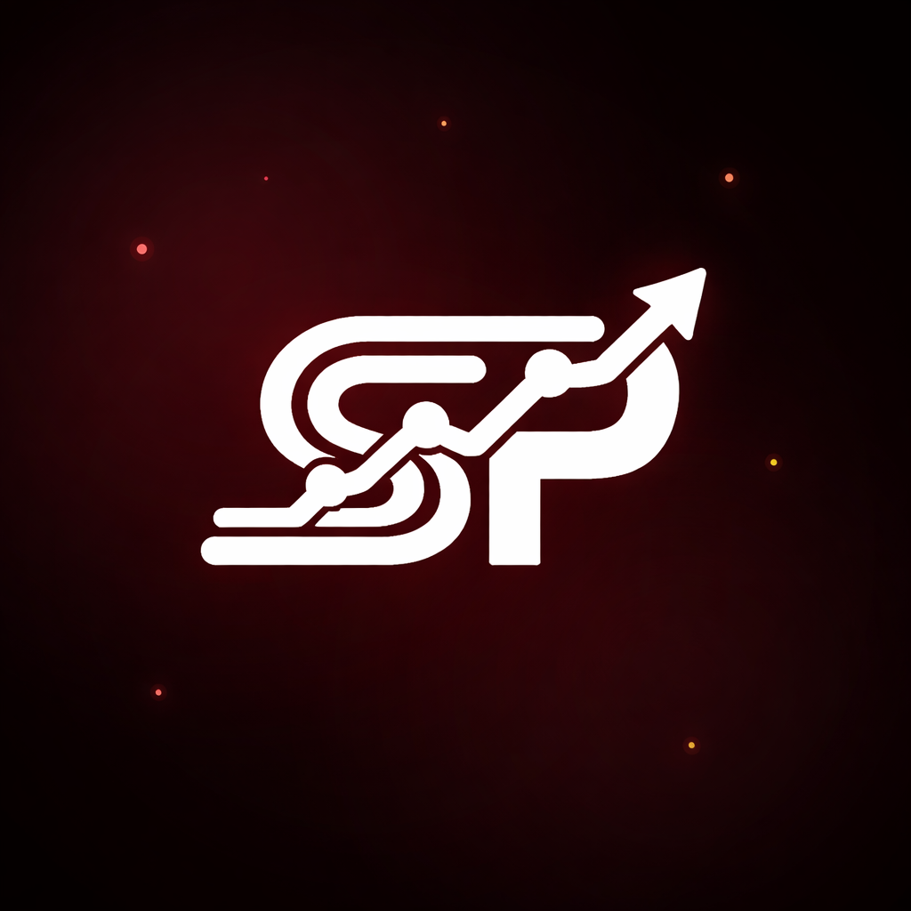

<p align="center">
  
</p>

<h1 align="center">SimPredict</h1>

<p align="center">
  <strong>Learn Machine Learning Through Racing</strong><br>
  An interactive iOS app that teaches ML concepts by predicting race outcomes
</p>

<p align="center">
  
  
  
  
</p>

---

## Demo

<!--
  To add your demo video:
  1. Go to this README on GitHub
  2. Click the pencil icon to edit
  3. Drag & drop your .mp4 screen recording right here
  4. GitHub will auto-upload and generate the embed code
  5. Commit the change
-->

> **Video coming soon** — a walkthrough of the full app experience from onboarding to race results.

---

## What is SimPredict?

SimPredict turns machine learning education into a hands-on racing experience. Instead of reading about algorithms, you **build models, feed them data, and watch your predictions race against reality** on iconic F1 circuits.

Pick your algorithm. Tune your data. Predict the podium. Then watch a full animated race simulation unfold — and see if your model got it right.

---

## Features

### Strategy Lab
- Choose from **6 ML algorithms** — Linear Regression, Decision Tree, Random Forest, KNN, Naive Bayes, and Neural Network
- Manage a roster of **5–20 drivers** with editable stats (qualifying, wins, track wins, DNFs)
- Select from **3 real F1 circuits** — Monza, Silverstone, Abu Dhabi
- Inject **noise columns** (Lucky Number, Zodiac Sign, Shoe Size...) to learn about overfitting
- Quick actions: shuffle qualifying, randomize stats, add outliers, flip everything

### Race Simulation
- Real-time **animated race** on SVG-rendered tracks
- Realistic physics: **DRS zones, ERS deployment, tire degradation, slipstream**
- Overtaking mechanics with lane management and attack zones
- DNF events based on driver reliability
- 3-lap races with up to 20 cars — run the same race up to 3 times

### Results & Analysis
- **Accuracy scoring** (0–100%) with weighted podium points
- Detailed breakdowns: why your model succeeded or failed
- **Model comparison** across all 6 algorithms simultaneously
- Convergence analysis — did all models agree on the winner?
- Track-specific performance insights

### Polish
- Dark racing aesthetic with glassmorphism UI
- Haptic feedback throughout (countdown, overtakes, DNFs, reveals)
- TipKit onboarding for first-time users
- Full iPad landscape support

---

## ML Algorithms Under the Hood

| Algorithm | Implementation Details |
|---|---|
| **Linear Regression** | Ridge regression with L2 regularization (λ = 0.01) |
| **Decision Tree** | Variance-based splitting, max depth 3 |
| **Random Forest** | 5 bootstrap-sampled trees, depth 2 each |
| **K-Nearest Neighbors** | Euclidean distance, configurable K (1–19) |
| **Naive Bayes** | Gaussian probability with Laplace smoothing |
| **Neural Network** | 2 hidden layers (6 → 4 nodes), ReLU activation, 30 epochs |

All models train on 4 features: **Qualifying Score, Career Wins, Track Wins, DNFs** — implemented from scratch in pure Swift with no external dependencies.

---

## Getting Started

### Requirements

- macOS 12+ with **Xcode 15+**
- iOS 18.1+ device or simulator

### Run the App

```bash
# Clone the repo
git clone https://github.com/DhruvGoswami10/SimPredict.git
cd SimPredict

# Open in Xcode
open SimPredict.swiftpm
```

Then select an iPhone/iPad simulator and press **Cmd + R**.

---

## Project Structure

```
SimPredict.swiftpm/
├── Models/
│   ├── AppModels.swift          # Core enums & data types
│   ├── Driver.swift             # Driver model (20-driver pool)
│   ├── MLEngine.swift           # 6 ML algorithms from scratch
│   └── RaceCar.swift            # Race simulation car state
├── ViewModels/
│   ├── AppViewModel.swift       # Phase navigation
│   ├── LabViewModel.swift       # ML training & data pipeline
│   ├── RaceViewModel.swift      # Race physics & simulation
│   └── ResultsViewModel.swift   # Accuracy scoring & analysis
├── Views/
│   ├── RootView.swift           # App navigation
│   ├── WelcomeFlowView.swift    # Onboarding flow
│   ├── LabView.swift            # 5-step strategy lab
│   ├── RaceSimulationView.swift # Real-time race view
│   ├── ResultsView.swift        # Prediction analysis
│   └── ...                      # Supporting views
├── Utilities/
│   ├── Theme.swift              # Design system
│   ├── HapticsManager.swift     # Haptic feedback
│   └── EmberBackgroundView.swift # Animated backgrounds
├── assets/                      # Track SVGs & app icon
└── Package.swift                # Swift Package manifest
```

---

## How It Works

```
┌─────────────┐    ┌──────────────┐    ┌────────────────┐    ┌─────────────┐
│   Welcome    │───>│ Strategy Lab │───>│ Race Simulation│───>│   Results   │
│  Onboarding  │    │  Build Model │    │  Watch It Race │    │  See Score  │
└─────────────┘    └──────────────┘    └────────────────┘    └─────────────┘
                          │                                         │
                          │         ┌─────────────────┐             │
                          └────────>│  Try New Model   │<───────────┘
                                    └─────────────────┘
```

1. **Onboard** — Learn what ML prediction means in a racing context
2. **Build** — Pick an algorithm, select drivers, tune their stats, choose a track
3. **Predict** — Your model generates a podium prediction (P1, P2, P3)
4. **Race** — Watch an animated simulation with realistic physics
5. **Analyze** — Compare your prediction to the actual result and understand why

---

## Built With

- **Swift 5.9** & **SwiftUI** — zero external dependencies
- **TipKit** — contextual onboarding tips
- **CoreGraphics** — SVG track path rendering
- All ML algorithms implemented **from scratch** — no CoreML, no Create ML

---

## License

This project is open source under the [MIT License](LICENSE).

---

<p align="center">
  Built with speed by <a href="https://github.com/DhruvGoswami10">Dhruv Goswami</a>
</p>
